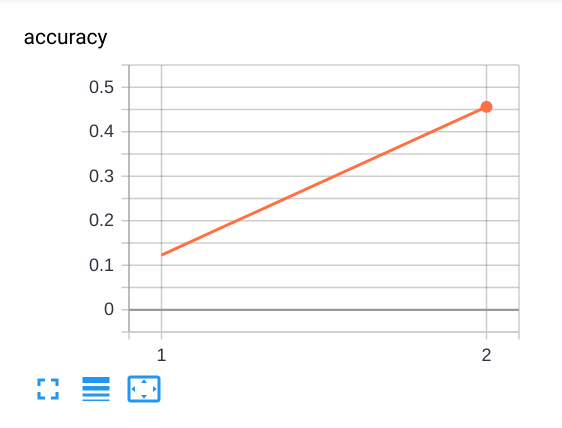

# Guild Example: `scalars`

This example illustrates how Guild captures and logs scalars.

- [guild.yml](guild.yml) - Project Guild file
- [train.py](train.py) - Sample train script that prints metrics to
  standard output
- [train_single_line_scalars.py](train_single_line_scalars.py) -
  Sample train script with an alternate metric log format
- [train_with_tensorboardX.py](train_with_tensorboardX.py) - Sample
  train script that uses
  [tensorboardX](https://github.com/lanpa/tensorboardX) to write TF
  event files directly

Guild associated metrics with a run by way of TF event files that are
written to the run directory. If you don't write TF event files,
that's okay, Guild can capture patterns from your script output and
log them for you. You can control this behavior by using a Guild file.

This example provides three operations, which are defined in the
[project Guild file `guild.yml`](guild.yml). Guild files provide
additional information about your project. In particular, use them to
define *operations*, which are formal definitions of what your scripts
do.

Refer to [`guild.yml`](guild.yml) for details on the three operations.

You can list the available operations from the command line this way:

    $ cd scalars
    $ guild ops

## Explicit scalar keys (`train`)

The `train` operation defines patterns for two scalars (`loss` and
`accuracy`) as well the special scalar name `step`, which determines
when the current step is set.

```
train:
  output-scalars:
    step: 'step: (\value)'
    loss: 'loss: (\value)'
    accuracy: 'accuracy: (\value)'
```

The special key `step` is required to tell Guild when the global step
has changed. Guild uses the latest global step when logging subsequent
scalar values. While you cannot change the special key value "step",
you are free to define any output pattern for that value.

Run the operation:

    $ guild run train -y

Note that `-y` simply runs the operation without prompting you.

View the scalars for the run:

    $ guild runs info --scalars

You can also view the results in TensorBoard:

    $ guild tensorboard

Note that `loss` and `accuracy` for the two steps are displayed in
TensorBoard. This is because Guild writes captured scalars to its own
TensorFlow event file (located in the `.guild` subdirectory for the
run). This is a convenient way to generate TensorBoard logs without
having to modify your code with scalar logging (though this is
supported if you want to - see below).



To quite TensorBoard, return to the command line and press `Ctrl-C`.

You can show the TF event files that Guild creates by listing all of
the files for the run:

    $ guild ls --all

Note the file `.guild/events.out.tfevents.` in the list.

## Generalized scalar format (`train2`)

You can define a general pattern to match any key/value combination,
provided that *value* can be parsed as a number.

The `train2` example defines such a pattern:

```
train2:
  output-scalars: '^(\key): (\value)'
```

Guild supports special escape sequences `\key` and `\value` that can
be used whenever you need to specify regular expression for keys and
values respectively.

In this example (which happens to mimic Guild's default capture
logic) any pattern `KEY: NUMBER` will be captured as a scalar.

To run the operation:

    $ guild run train2 -y

View the captured scalars:

    $ guild runs info --scalars

## Disabling output scalars (`train3`)

If you are logging scalars directly to TF event files (e.g. by [using
TensorFlow summary file
writer](https://www.tensorflow.org/api_docs/python/tf/summary/FileWriter),
[tensorboardX](https://github.com/lanpa/tensorboardX) or another
library, you can disable output scalar capture altogether by setting
`output-scalars` to `no`.

The `train3` operation illustrates this:

```
train3:
  output-scalars: no
```

The `train3` operation runs
[`train_with_tensorboardX.py`](train_with_tensorboardX.py) to
explicitly log scalars.

    $ guild run train3 -y

Show the scalars:

    $ guild runs info --scalars

You can show the files generated by the operation:

    $ guild ls

Note that a TF event file was written to the run directory root via the
`tensorboardX` library.

## Compare runs

Logged scalars are used in run comparisons. To compare the three
example runs (spoiler, they all have the same hard-coded results ;)
run:

    $ guild compare

You can generate the output in CSV format:

    $ guild compare --csv
